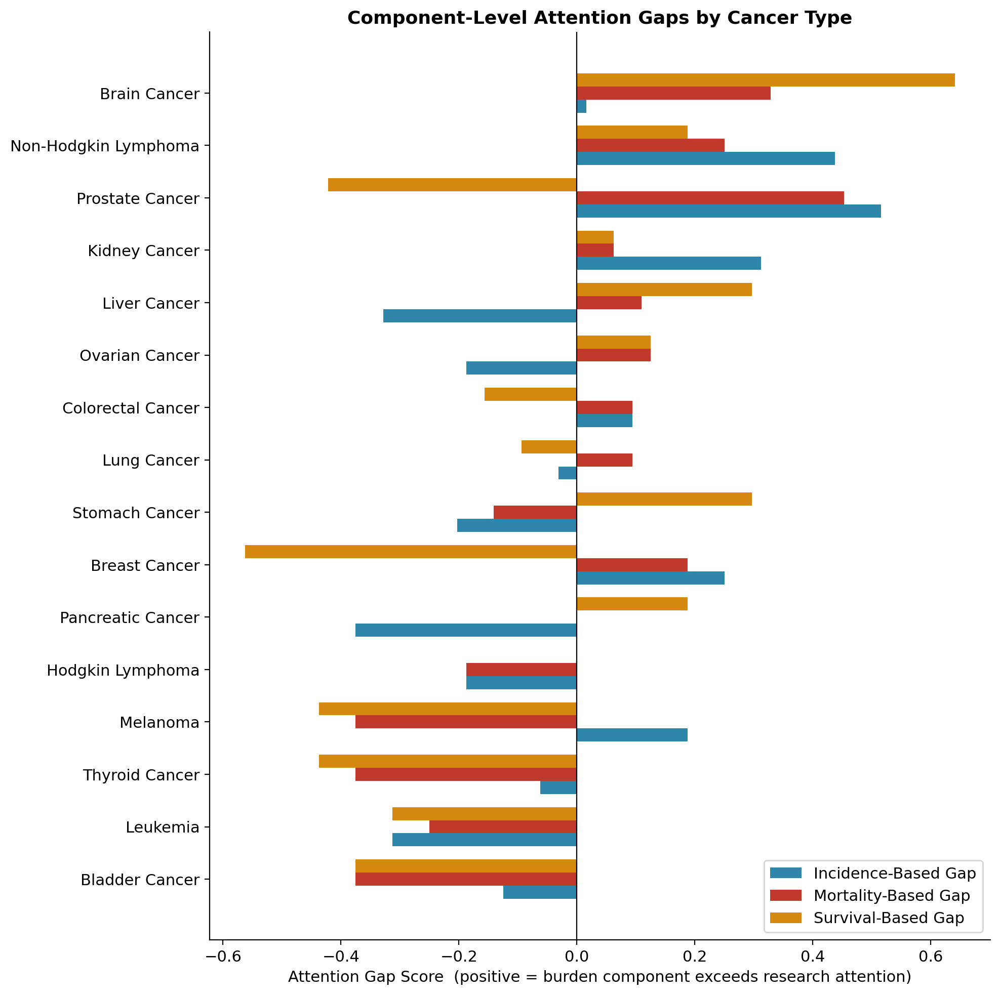
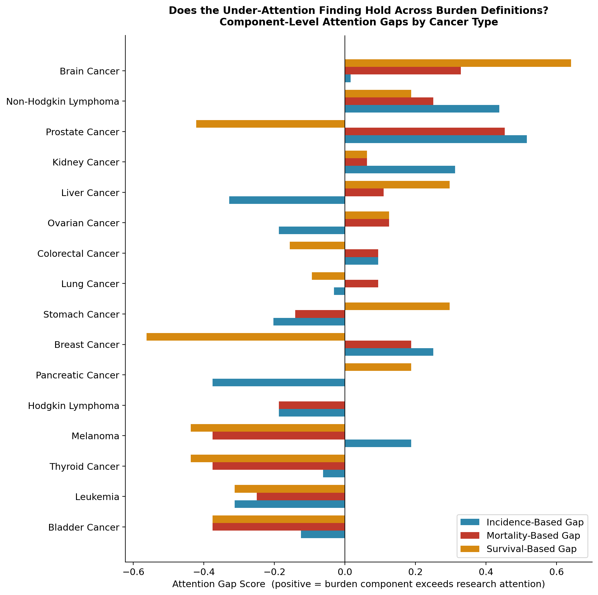
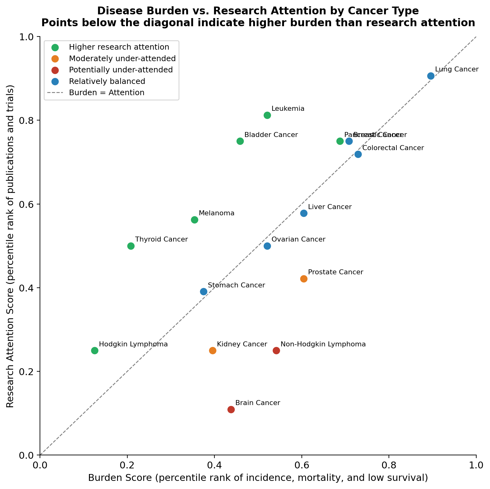
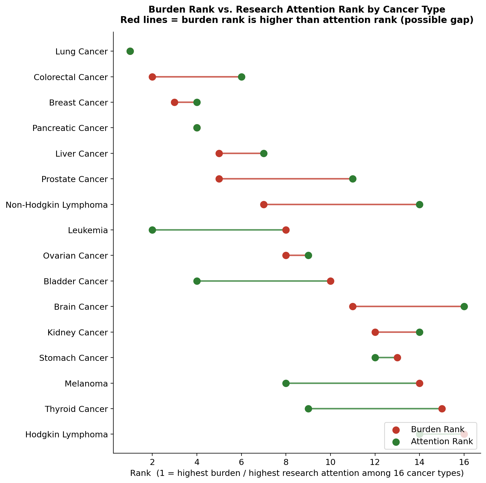
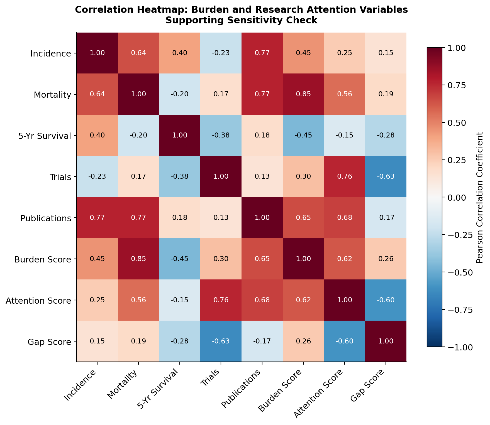
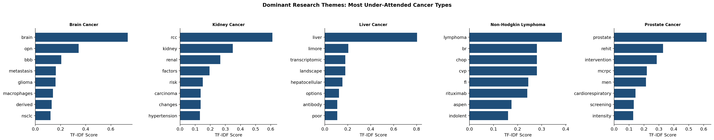
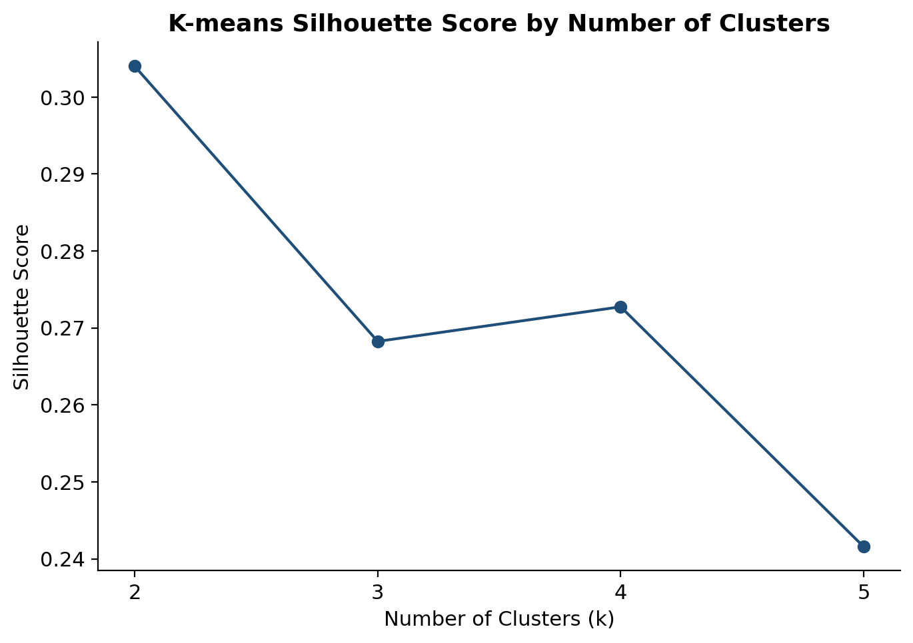
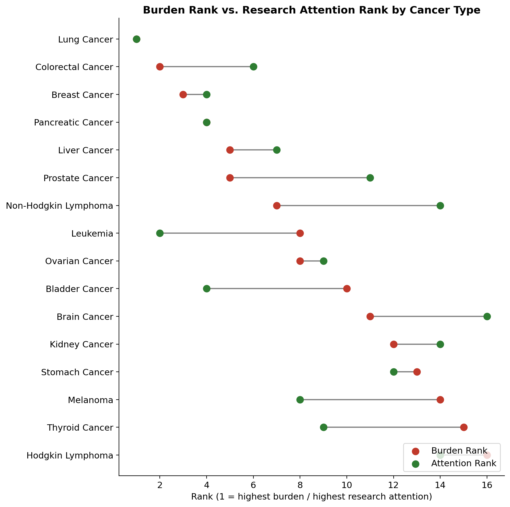

# Mapping the Cancer Research Attention Gap Using Unsupervised Learning

<p align="center">
  <b>Unsupervised Learning · Public Health Analytics · Research Funding Strategy · Text Analytics</b>
</p>

<p align="center">
  
</p>

## Project Overview

This project analyzes whether cancer research attention is aligned with disease burden across sixteen major cancer types from 2019 to 2023.

We built a data-driven screening framework that compares disease burden with measured research attention. Disease burden is represented through incidence, mortality, and five-year survival. Research attention is represented through PubMed publication counts and ClinicalTrials.gov clinical trial counts.

The goal is not to prove that any cancer type is definitively underfunded. Instead, this project identifies where disease burden and measured research attention appear least aligned, helping research funding agencies and public health decision-makers focus expert review capacity more effectively.

## Research Question

**Are cancer research resources aligned with the burden of disease?**

## Project Snapshot

| Category | Summary |
|---|---|
| Final Metric | Composite Attention Gap Score |
| Dataset | 16 cancer types, 2019–2023 |
| Unit of Analysis | Cancer type |
| Burden Measures | Incidence, mortality, lower five-year survival |
| Attention Measures | PubMed publications, ClinicalTrials.gov trials |
| Main Methods | Percentile ranking, component checks, K-means clustering, TF-IDF |
| Primary Finding | Brain Cancer and Non-Hodgkin Lymphoma showed the strongest positive attention gaps |
| Decision Use | Screening tool for expert review, not a funding directive |

## Data Sources

This project uses publicly available data from:

- SEER Cancer Stat Facts
- ClinicalTrials.gov
- PubMed / NCBI

## Dataset

The final dataset includes:

- 16 major cancer types
- 2019–2023 analysis period
- 80 cancer-year observations

Cancer type is used as the final unit of analysis. Rate-based variables such as incidence, mortality, and five-year survival were averaged across years. Count-based variables such as publications and clinical trials were summed across years.

## Methodology

The project uses a combination of ranking-based scoring, unsupervised learning, and text analysis methods:

- Percentile-rank normalization
- Composite Attention Gap Score
- Component-level sensitivity checks
- Correlation analysis
- K-means clustering
- TF-IDF theme exploration

The main metric is the **Composite Attention Gap Score**:

```text
Attention Gap Score = Burden Score - Research Attention Score
```

Where:

```text
Burden Score = average percentile rank of incidence, mortality, and lower five-year survival

Research Attention Score = average percentile rank of PubMed publications and ClinicalTrials.gov trials
```

A positive score suggests that disease burden appears higher than measured research attention. A near-zero score suggests relative alignment. A negative score suggests that measured research attention meets or exceeds burden within this dataset.

## Key Findings

The analysis found that:

- **Brain Cancer** showed the largest positive Attention Gap Score.
- **Non-Hodgkin Lymphoma** showed the second-largest positive gap and remained positive across incidence, mortality, and survival components.
- **Prostate Cancer** and **Kidney Cancer** showed moderate positive gaps.
- **Lung Cancer** and **Pancreatic Cancer** remain clinically important, but appeared relatively balanced or higher-attention under this model.
- **Thyroid Cancer**, **Bladder Cancer**, and **Leukemia** showed the strongest inverse pattern, where measured attention met or exceeded measured burden.

## Research Visualizations

The following charts summarize the main analytical outputs from the project. Together, they show how cancer disease burden compares with measured research attention across sixteen major cancer types.

### 1. Component-Level Attention Gaps

This chart decomposes the Attention Gap Score into incidence, mortality, and survival-based gaps. It helps identify whether each cancer type’s signal is volume-driven, severity-driven, or consistent across multiple burden measures.

<p align="center">
  
</p>

**Key takeaway:** Brain Cancer is mainly severity-driven, while Non-Hodgkin Lymphoma remains positive across incidence, mortality, and survival.

---

### 2. Burden Score vs. Research Attention Score

This scatter plot compares disease burden with measured research attention. Cancer types below the balance line may warrant closer expert review because burden appears higher than attention.

<p align="center">
  
</p>

**Key takeaway:** Brain Cancer and Non-Hodgkin Lymphoma sit furthest from balance, supporting their high review-priority status.

---

### 3. Burden Rank vs. Attention Rank

This dumbbell chart compares each cancer type’s burden rank with its research attention rank, showing where the ranking mismatch is most visible.

<p align="center">
  
</p>

**Key takeaway:** Rank-based comparison helps show whether measured research attention is proportionate to disease burden.

---

### 4. Correlation Heatmap

This heatmap shows relationships among burden and research attention variables. It supports the use of publications and clinical trials as complementary research attention proxies.

<p align="center">
  
</p>

**Key takeaway:** Publications and clinical trials capture different parts of research attention, strengthening the composite framework.

---

### 5. TF-IDF Theme Exploration

This chart shows dominant research terms for selected high-gap cancer types. TF-IDF adds qualitative context to the quantitative scoring model.

<p align="center">
  
</p>

**Key takeaway:** TF-IDF provides research-theme context, but it is not used as a funding or research-quality measure.

---

### 6. Silhouette Scores by K

This chart supports the clustering analysis by comparing silhouette scores across different values of k.

<p align="center">
  
</p>

**Key takeaway:** The clustering analysis was used as a supporting method to contextualize burden-attention profiles.

---

### 7. Advanced Dumbbell Rank Chart

This chart provides another view of the gap between burden ranking and research attention ranking.

<p align="center">
  
</p>

**Key takeaway:** Rank-based visualizations make burden-attention misalignment easier to interpret for decision-makers.

## Decision-Maker Interpretation

This project is designed as a **screening tool**, not a funding directive.

The results can help research funding agencies identify cancer types that may warrant closer expert review. However, final funding decisions require additional evidence, including direct funding data, clinical expertise, trial pipeline information, subtype-level analysis, patient access data, and treatment outcome trends.

## Recommendations

Based on the final analysis:

1. **Prioritize closer expert review for Brain Cancer and Non-Hodgkin Lymphoma.**  
   These cancer types showed the strongest positive attention-gap signals, but with different drivers.

2. **Use Prostate Cancer and Kidney Cancer as monitoring cases.**  
   Their positive gaps were meaningful but more moderate.

3. **Contextualize Lung Cancer and Pancreatic Cancer carefully.**  
   These cancers remain clinically important, but appeared relatively balanced or higher-attention under this attention-gap model.

4. **Use component-level checks before acting on the composite score.**  
   Incidence, mortality, and survival can tell different stories.

5. **Treat the framework as a starting point for expert review.**  
   The score should guide deeper investigation, not replace funding expertise.

## Tools and Technologies

- Python
- pandas
- NumPy
- scikit-learn
- matplotlib
- seaborn
- TF-IDF vectorization
- K-means clustering
- Jupyter Notebook
- Microsoft Word
- Microsoft PowerPoint

## Repository Structure

```text
analysis_notebooks/   Working and final analysis notebooks
data/                 Cleaned and processed datasets
outputs/              Charts and analytical outputs
report/               Final written report
presentation/         Final presentation deck and speech script
```

## Project Deliverables

- Final analysis notebook
- Working analysis notebook
- Cleaned dataset
- Processed analysis tables
- Final charts
- Final written report
- Final presentation deck
- Presentation speech script

## Limitations

This analysis uses publication counts and clinical trial counts as proxy indicators of research attention. These measures do not directly capture funding amount, research quality, patient access, clinical outcomes, industry investment, or trial enrollment size.

Cancer categories are broad and may hide important subtype-level differences. The Attention Gap Score is relative within this sixteen-cancer dataset and should be interpreted as a preliminary prioritization signal rather than definitive evidence of underinvestment.

## Authors

Group 2  
Columbia University  
APANPS5205 — Applied Analytics Frameworks and Methods II

- Claudia Orisakwe
- Farzana Khan Moutushi
- Simran Chawla
- Wen Jiang


